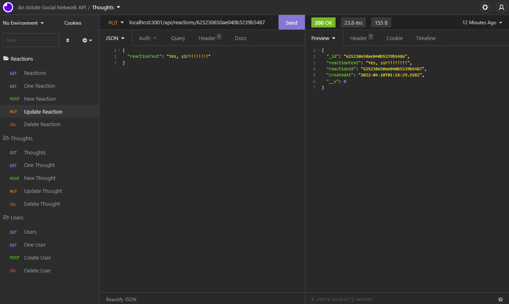
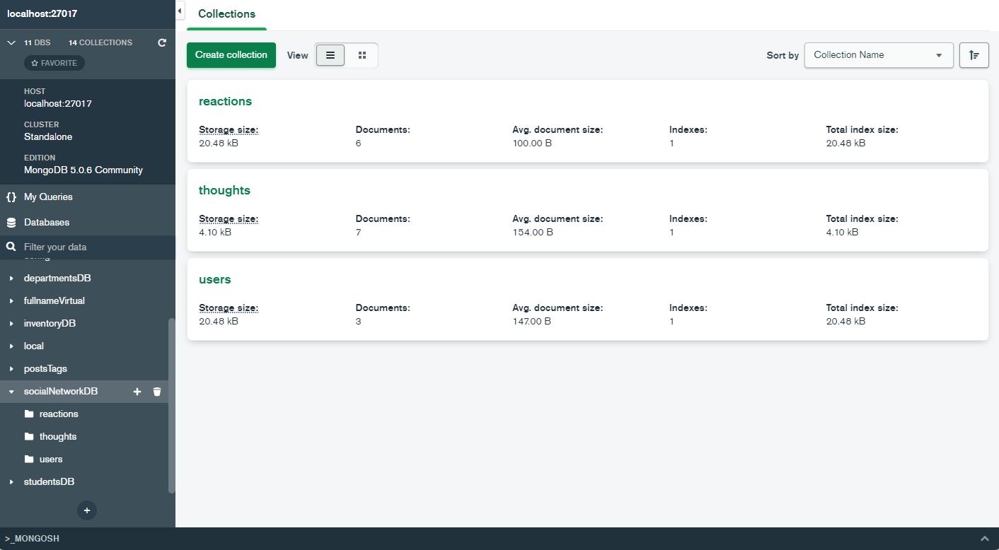

# 18 NoSQL: Social Network API

This API uses NoSQL / MongoDB to perform CRUD operations on a unique, unstructured database.

## Description

- This application offers the perfect example of a Social Network API built on MongoDB. Users can Create, Read, Update, and Write to 3 Models and maintain their thoughts and reactions.

## Table of Contents

- [License](#license)
- [Installation](#installation)
- [Usage](#usage)
- [Features](#features)
- [Credits](#credits)
- [Tests](#tests)
- [Questions](#questions)
- [Contribute](#Contribute)

## License

- Unlicensed

Refer to [https://choosealicense.com/](https://choosealicense.com/).

## Installation

To install this application, please follow the steps below:

1. In the integrated terminal, on the parent directory, run `npm i`
2. In the same terminal, run `node server.js`
3. In Insomnia, use CRUD Operations to Manipulate the data in the database

- EXTENSIONS:
  - api/users/:userId
  - api/thoughts/:thoughtId
  - api/reactions/:reactionId

## Usage

- This applications uses MongoDB and Mongoose NPM to store data in the database and manipulate the data.
- Demo: https://youtu.be/KvOqC0pJeuM
- GitHub: https://github.com/smeske10/An-Astute-Social-Network-API

## Credits

- This application uses [MongoDB](https://www.mongodb.com/docs/manual/crud/) and [Mongoose NPM](https://www.npmjs.com/package/mongodb) to configure a connection between the server and database.

## Questions

If you have any questions about the repo, open an issue or contact me directly at undefined. You can find more at [smeske10](https://github.com/smeske10/).

## Contribute

- Contact me directly at my GitHub

The [Contributor Covenant](https://www.contributor-covenant.org/) is an industry standard, but you can always write your own if you'd prefer.
